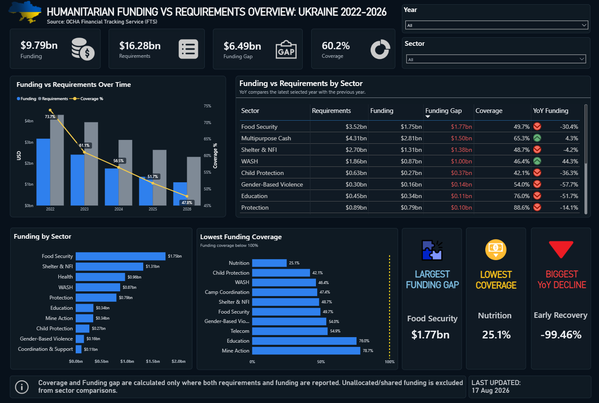

# Ukraine Humanitarian Funding Analysis

An interactive Power BI project exploring how humanitarian funding in Ukraine compares with reported needs across sectors from **2022 to 2026**.

The project uses data from the **OCHA Financial Tracking Service (FTS)** and combines **PostgreSQL and Power BI** to move from raw humanitarian funding data to a cleaned analytical dataset and an interactive dashboard.


## What I wanted to explore

Humanitarian sectors report how much funding they need, but how much of those needs are actually covered?

The dashboard helps answer questions such as:

- Which sectors receive the most funding?
- Which sectors have the largest funding gaps?
- How much of reported requirements is actually covered?
- How has funding changed from year to year?
- Which sectors experienced the strongest decline in funding?

## Dashboard

The report includes:

**Funding** — reported funding that can be compared with requirements  
**Requirements** — reported humanitarian needs  
**Funding Gap** — Requirements − Funding  
**Coverage** — Funding / Requirements  
**YoY Funding Change** — change in funding compared with the previous year

The dashboard can be filtered by **year** and **sector**.

It also highlights three dynamic insights:

**Largest Funding Gap**  
**Lowest Funding Coverage**  
**Biggest YoY Funding Decline**



## Data Pipeline
 
```text
OCHA FTS / HDX
      ↓
CSV
      ↓
PostgreSQL
      ↓
Data validation & SQL transformations
      ↓
Analytical View
      ↓
Power BI
      ↓
DAX measures & dashboard
```
## Data Quality

One of the main challenges was that not every sector has both `funding` and `requirements` reported for every year.

I deliberately did **not** replace missing values with zero:

**NULL ≠ 0**

If a requirement is missing, it would be misleading to calculate funding coverage or a funding gap for that observation.

Because of this, **Coverage** and **Funding Gap** are calculated only where both funding and requirements are available.

I also checked the data for:

- duplicate sector-year observations
- missing funding and requirements
- zero and negative values
- consistency of the source `percent_funded`
- sector availability across years
- duplicate humanitarian plans in 2022

The final analytical scope covers **2022–2026**.

An obsolete 2022 plan record (`plan_id = 1081`) was excluded from the analysis.

## Sector Classification

The FTS dataset also contains categories that do not represent individual humanitarian sectors, such as:

- `Not specified`
- `Multiple clusters/sectors (shared)`
- `Multi-sector`
- `Other`

These records remain in the data but are excluded from sector comparisons where appropriate.

I also shortened several sector names in Power BI to make the dashboard easier to read:

```text
Protection - Mine Action → Mine Action
Protection - Child Protection → Child Protection
Protection - Gender-Based Violence → Gender-Based Violence
Water Sanitation Hygiene → WASH
Emergency Shelter and NFI → Shelter & NFI
```
## Tools

- **PostgreSQL** — data storage, validation and analytical transformations
- **DBeaver** — SQL development and data quality checks
- **Power BI** — data modelling, DAX and dashboard development
- **Git / GitHub** — version control and project documentation


## Dashboard Access

A public interactive link to the Power BI dashboard is currently unavailable because I do not have access to the publishing options required for public sharing.

Instead, I will attach the **Power BI `.pbix` file** separately, so the dashboard can be opened and explored locally in **Power BI Desktop**.

The repository also includes an animated GIF showing the main dashboard interactions and filters.


## Data Source

**OCHA Financial Tracking Service (FTS)**  
Dataset: *Ukraine — Requirements and Funding Data*  
Available through the **Humanitarian Data Exchange (HDX)**.

Primary file used:

`fts_requirements_funding_globalcluster_ukr.csv`

## Project Structure

```text
.
├── README.md
├── powerbi/
│   └── ukraine_humanitarian_funding.pbix
└── assets/
    └── dashboard_demo.gif
    └── dashboard.png
```
